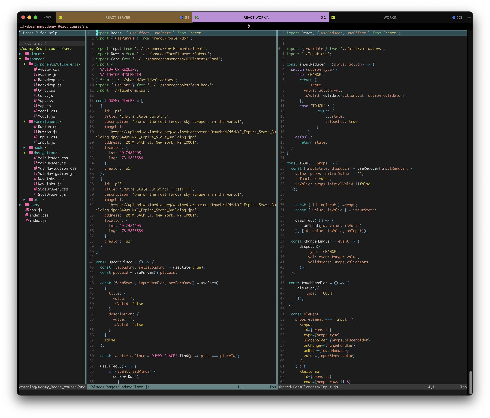

# graslowsnail's nvim setup
Heres my current nvim config, all plugings were installed with Vim-plug, for my terminal I use iterm and customized using the settings.NOTE: tree sitter messs up the init.vim file
## Favorit plugins!
* Nerd Tree - File navigation in vim
* Devivons - Adds file icons on nerd tree!
* tree sitter - adds more syntax color!
* papercolor - Current theme!


## Screenshots




## Installation

Install the plugins with Plug install! To customize each to your liking visit the links below!
* Add to init.vim to disable Preview split  
```bash
  set completeopt-=preview

```


* Plugin install - https://github.com/junegunn/vim-plug
* Syntax color - https://github.com/nvim-treesitter/nvim-treesitter
* Nerd Tree - https://github.com/preservim/nerdtree
* Devivons - https://github.com/ryanoasis/vim-devicons
* Linter - https://github.com/dense-analysis/ale
* Theme - https://vimcolorschemes.com
* jsx-pretty - https://github.com/MaxMEllon/vim-jsx-pretty


```bash
  :PlugInstall
```

  A MUST FOR SUPER SMOOTH WORKFLOW!! 

  SET NERD TREE toggle TO CTRL + N while in vim. ( place inside init.vim file )
```bash
nnoremap <C-n> :NERDTreeToggle<CR>
```

  Exits Vim if NERDTree is the only window remaining in the only tab. ( place inside init.vim file )
```bash
autocmd BufEnter * if tabpagenr('$') == 1 && winnr('$') == 1 && exists('b:NERDTree') && b:NERDTree.isTabTree() | quit | endif
```
