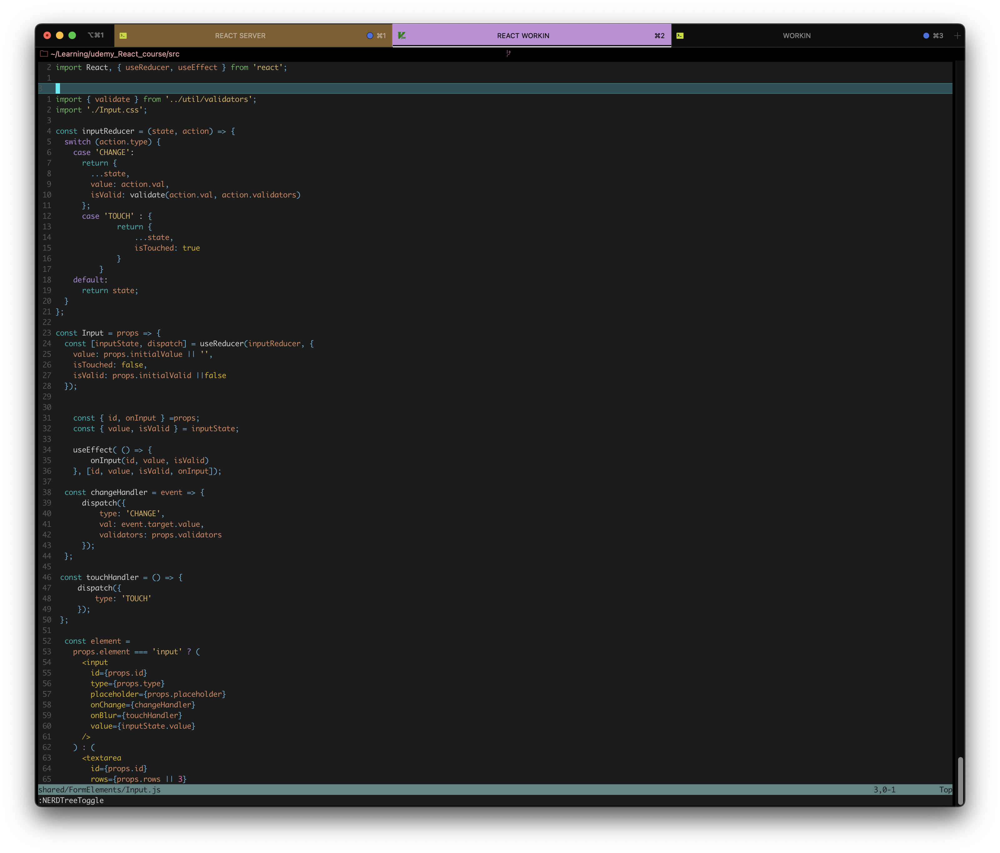

# graslowsnail's nvim setup
Heres my current nvim config, all plugings were installed with Vim-plug
## Favorit plugins!
* Nerd Tree- File navigation in vim
* tree sitter- adds more syntax color!


## Screenshots




## Installation

Install the plugins with Plug instal!
https://github.com/junegunn/vim-plug

```bash
  :PlugInstall
```
